# Алгоритмический каркас

> Основные реализации: `internal/probe/probe.go`,
> `internal/health/service.go`, `internal/artifact/artifact.go`.

Этот документ фиксирует flowchart как основной алгоритмический контракт. Код
не обязан копировать каждый блок в отдельную функцию или shell-команду:
дублирование decision logic нарушит единый probe contract.

## Главный принцип

Одна точка проверки маршрута:

```text
probe.ProbeRoute(ctx, cfg, domain, service, route)
```

Маршрут отличается только `config.Route` дескриптором:

```json
{ "type": "direct",   "tag": "direct" }
{ "type": "drop",     "tag": "drop" }
{ "type": "zapret",   "tag": "zapret" }
{ "type": "smart_dns","tag": "xbox-dns", "dns_server": "DNS_SERVER_PLACEHOLDER" }
{ "type": "vless",    "tag": "vpn-frankfurt-3", "socks5": "127.0.0.1:12003", "dns_mode": "socks_remote" }
{ "type": "tg_ws_proxy","tag": "tg-ws" }
```

Запрещённый анти-паттерн: `check_direct()`, `check_zapret()`, `check_vless()` —
они размножат сетевую логику.

## Четыре независимых уровня (контракт `probe.RouteResult`)

1. **DNS resolution** — `resolveForRoute`: `system` / `smart_dns` (UDP+TCP
   fallback) / `socks_remote` (DNS over SOCKS5). `validateDNSResponse`: ID, rcode,
   question, CNAME loop/limit, size, answer limit, unsafe-ответ guard.
2. **Классификация** — `probeOne`→`runHTTPAttempt`: transport, TLS/SNI, HTTP
   status, redirects, content markers, `RegionalBlock`, `SuspectedTSPU`.
3. **Фактический egress** — `probeExternalIP`: `ExternalIPHash`, `ExternalCountry`,
   `ExternalCountrySources`, `EgressConsensus`. `RequireNonRUEgress` →
   `RU_EXIT`/`FAIL`.
4. **Доказательство маршрута** — `beginPathProof`/`finishWithPathProof`:
   `PathVerified`, `NFTMark`, `ConntrackMark`, `IPRulePriority`, `RouteTable`,
   `Interface`, `SocketMark`, `XrayOutboundTag`, `PathEvidence`. Binding проверяет
   `evidence.ValidateRouteProof`.

Уровни независимы: `http_ok=true` без `path_verified=true` → `UNVERIFIED`,
маршрут не выбирается.

## Единый результат

```json
{
  "domain": "example.com",
  "service": "example",
  "route": "vpn-frankfurt-3",
  "route_type": "vless",
  "status": "OK",
  "application_status": "OK",
  "path_verified": true,
  "adapter_revision": "rev_10_...",
  "candidate_hash": "sha256:...",
  "dns_ok": true,
  "transport_ok": true,
  "tls_ok": true,
  "http_ok": true,
  "content_ok": true,
  "service_ok": true,
  "regional_block": false,
  "suspected_tspu": false,
  "external_ip_hash": "sha256:...",
  "external_country": "DE",
  "egress_consensus": true,
  "latency_ms": 126,
  "checked_at": "2026-07-14T12:00:00+00:00"
}
```

Статусы: `OK`, `DEGRADED`, `FAIL`, `REGION_BLOCK`, `SUSPECTED_TSPU`, `RU_EXIT`,
`NOT_CONFIGURED`, `UNVERIFIED`.

## Единые механизмы

1. `build_candidates(domain, service, policy)` — очередь маршрутов по
   `allowed_paths`/category/TSPU evidence.
2. `probe.ProbeRoute(...)` — одинаково проверяет любой route.
3. `select_best_route(results, policy)` — надёжность > задержка, `path_verified`
   обязателен.
4. `apply_route_plan(plan)` — атомарная транзакция adapter: snapshot → apply →
   verify → commit/rollback (см. `adapter-transaction.md`).

## Flowchart

```mermaid
flowchart TD
    START["Клиент запрашивает домен"] --> INTERCEPT["Flint 2 перехватывает DNS 53/tcp/udp"]
    INTERCEPT --> NORMALIZE["Нормализовать имя, eTLD+1, отделить локальные/служебные зоны"]
    NORMALIZE --> MANUAL{"Ручная политика / override?"}
    MANUAL -- "BLOCKED" --> DROP_MANUAL["DROP"]
    MANUAL -- "DIRECT_ONLY" --> BUILD_DIRECT["Очередь: direct"]
    MANUAL -- "GEO_LOCKED" --> KILLSWITCH["Kill-switch на WAN, запрет direct/zapret"]
    MANUAL -- "TELEGRAM" --> BUILD_TG["Очередь: tg_ws_proxy -> VLESS"]
    MANUAL -- "TSPU_RESTRICTED" --> BUILD_TSPU["Очередь: zapret -> smart_dns -> VLESS"]
    MANUAL -- "DIRECT_PREFERRED" --> BUILD_DP["Очередь: direct -> zapret -> smart_dns -> VLESS"]
    MANUAL -- "обычная/unknown" --> TSPU_LIST{"TSPU evidence match?"}
    TSPU_LIST -- "да" --> BUILD_TSPU
    TSPU_LIST -- "нет" --> BUILD_UNKNOWN["Очередь: direct"]
    KILLSWITCH --> BUILD_GEO["Очередь: smart_dns -> VLESS по рейтингу"]
    BUILD_DIRECT --> POLICY_READY
    BUILD_GEO --> POLICY_READY
    BUILD_TG --> POLICY_READY
    BUILD_TSPU --> POLICY_READY
    BUILD_DP --> POLICY_READY
    BUILD_UNKNOWN --> POLICY_READY
    POLICY_READY["Политика и очередь кандидатов готовы"] --> CACHE{"Свежая decision cache?"}
    CACHE -- "да, route разрешён" --> USE_ACTIVE["Применить сохранённый маршрут"]
    CACHE -- "нет/stale/запрещён" --> START_PROBE["Проверка очереди кандидатов"]
    USE_ACTIVE --> RETURN_DNS["Вернуть клиенту DNS-ответ"]
    START_PROBE --> NEXT_ROUTE{"Непроверенный кандидат?"}
    NEXT_ROUTE -- "нет" --> SELECT["Оценить все результаты"]
    NEXT_ROUTE -- "да" --> ROUTE_ALLOWED{"Разрешён политикой и компонент доступен?"}
    ROUTE_ALLOWED -- "нет" --> SAVE_FORBIDDEN["FORBIDDEN/UNAVAILABLE"]
    SAVE_FORBIDDEN --> NEXT_ROUTE
    ROUTE_ALLOWED -- "да" --> PROBE["probe.ProbeRoute(domain, service, route)"]
    PROBE --> L1["1. DNS resolution: resolver/protocol/IP, safe/unsafe"]
    L1 --> L2["2. Классификация: HTTP/content/regional/TSPU"]
    L2 --> L3["3. Фактический egress: IP hash + country consensus"]
    L3 --> L4["4. Доказательство маршрута: mark/rule/table/outbound/path"]
    L4 --> CLASSIFY{"Итог probe_route"}
    CLASSIFY -- "OK + path_verified" --> SAVE_OK["OK, latency, evidence"]
    CLASSIFY -- "OK без path_verified" --> SAVE_UNVERIFIED["UNVERIFIED — не выбирается"]
    CLASSIFY -- "REGION_BLOCK" --> SAVE_REGION
    CLASSIFY -- "SUSPECTED_TSPU" --> SAVE_TSPU
    CLASSIFY -- "RU_EXIT" --> SAVE_RU
    CLASSIFY -- "FAIL/DEGRADED" --> SAVE_FAIL
    SAVE_OK --> DISCOVERY
    SAVE_UNVERIFIED --> DISCOVERY
    SAVE_REGION --> DISCOVERY
    SAVE_TSPU --> DISCOVERY
    SAVE_RU --> DISCOVERY
    SAVE_FAIL --> DISCOVERY
    DISCOVERY{"Discovery: regional/TSPU/fallback?"}
    DISCOVERY -- "regional, не GEO_LOCKED" --> MARK_GEO["Пометить GEO_LOCKED, убрать direct/zapret"]
    DISCOVERY -- "TSPU на direct, нет zapret" --> ADD_ZAPRET["Добавить zapret в очередь"]
    DISCOVERY -- "fail, есть fallback" --> ADD_FALLBACK["Добавить smart_dns/VLESS"]
    DISCOVERY -- "ok / fallback есть" --> NEXT_ROUTE
    MARK_GEO --> NEXT_ROUTE
    ADD_ZAPRET --> NEXT_ROUTE
    ADD_FALLBACK --> NEXT_ROUTE
    SELECT --> HAVE_OK{"path_verified OK разрешённые?"}
    HAVE_OK -- "да" --> RANK["Рейтинг: надёжность > задержка"]
    HAVE_OK -- "нет" --> HAVE_DEGRADED{"DEGRADED разрешён?"}
    RANK --> CHOOSE["Выбрать лучший маршрут"]
    CHOOSE --> CHANGED{"Отличается от текущего?"}
    CHANGED -- "нет" --> REFRESH["Обновить время/счётчики"]
    CHANGED -- "да" --> STABILITY{"Hysteresis: достаточно подтверждений?"}
    STABILITY -- "нет" --> KEEP_CURRENT
    STABILITY -- "да" --> TX["Транзакция adapter"]
    TX --> VAL["validate candidate -> сгенерировать artifacts (manifest v6)"]
    VAL --> SNAP["snapshot nft/dnsmasq/Xray/Zapret/UCI/IP"]
    SNAP --> APPLY["apply: routes -> rules -> fw4, start services"]
    APPLY --> VERIFY["verify management + data plane (4 уровня)"]
    VERIFY --> VOK{"verify OK?"}
    VOK -- "да" --> COMMIT["adapter.Commit -> promote bbolt"]
    VOK -- "нет" --> ROLLBACK["adapter.Rollback -> restore snapshot"]
    ROLLBACK --> ROK{"rollback OK?"}
    ROK -- "да" --> MARK_SWITCH_FAIL
    ROK -- "нет" --> EMERGENCY["Аварийные безопасные правила"]
    COMMIT --> SAVE_DB["Сохранить матрицу и выбранный путь"]
    REFRESH --> SAVE_DB
    KEEP_CURRENT --> SAVE_DB
    HAVE_DEGRADED -- "да" --> CHOOSE_DEGRADED["DEGRADED как временный"]
    HAVE_DEGRADED -- "нет" --> NO_ROUTE["Нет безопасного маршрута"]
    CHOOSE_DEGRADED --> TX
    NO_ROUTE --> FAILURE_POLICY{"Политика домена"}
    FAILURE_POLICY -- "GEO_LOCKED/TELEGRAM/BLOCKED" --> SAFE_DROP["DROP IPv4+IPv6"]
    FAILURE_POLICY -- "DIRECT_ONLY" --> DIRECT_ERROR["Ошибка без зарубежного выхода"]
    FAILURE_POLICY -- "обычная" --> TEMP_ERROR["Временная ошибка"]
    EMERGENCY --> SAFE_DROP
    SAFE_DROP --> ALERT["Критическое уведомление"]
    DIRECT_ERROR --> ALERT
    TEMP_ERROR --> ALERT
    SAVE_DB --> SERVE{"Ответ клиенту?"}
    SERVE -- "да" --> RETURN_DNS
    SERVE -- "нет" --> END_BG["Завершить фоновую проверку"]
    RETURN_DNS --> CLIENT["Клиент устанавливает соединение"]
    CLIENT --> OBSERVE{"Соединение успешно?"}
    OBSERVE -- "да" --> PASSIVE_OK["Обновить last-success"]
    OBSERVE -- "нет" --> PASSIVE_FAIL["Счётчик ошибок"]
    PASSIVE_FAIL --> FAIL_LIMIT{"Порог ошибок?"}
    FAIL_LIMIT -- "нет" --> KEEP_ROUTE["Сохранить маршрут"]
    FAIL_LIMIT -- "да" --> RECHECK["Срочная перепроверка"]
    KEEP_ROUTE --> END["Завершить"]
    PASSIVE_OK --> END
    DROP_MANUAL --> END
    ALERT --> END_BG
    END_BG --> SCHED["Фоновый планировщик: jitter, budgets, ≤1 тяжёлый кандидат"]
    SCHED --> HEALTH["health.Service.RunCycle: VLESS quorum, EWMA, roles"]
    HEALTH --> SERVER_MATRIX["Матрица server x service, selected/standby/quarantine"]
    SERVER_MATRIX --> ACTIVE_AFFECTED{"Активный маршрут упал?"}
    ACTIVE_AFFECTED -- "да" --> RECHECK
    ACTIVE_AFFECTED -- "нет" --> END_BG
```



## Отклонения от flowchart

`APPLY_ATOMIC` реализован как полная транзакция control plane + production
helper (`adapter.Interface`), а не ad-hoc shell. `VERIFY` требует все четыре
уровня, включая bound path proof (`evidence.ValidateRouteProof`). Reboot
recovery (`adapter.Reconcile` через `api.recoverCommittedDataplane`) восстанавливает
committed dataplane после рестарта — отдельный путь, не показан в hot-path flow.
